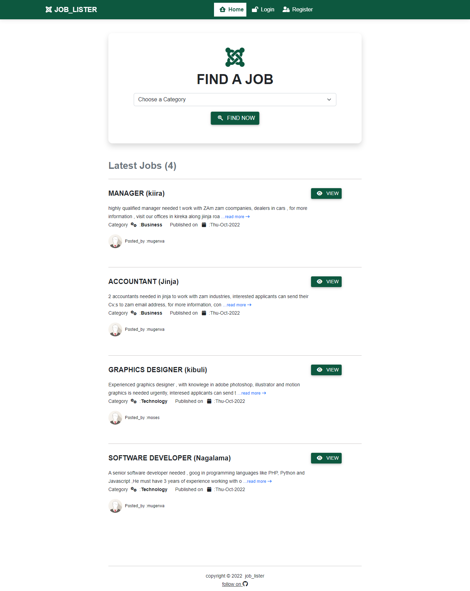
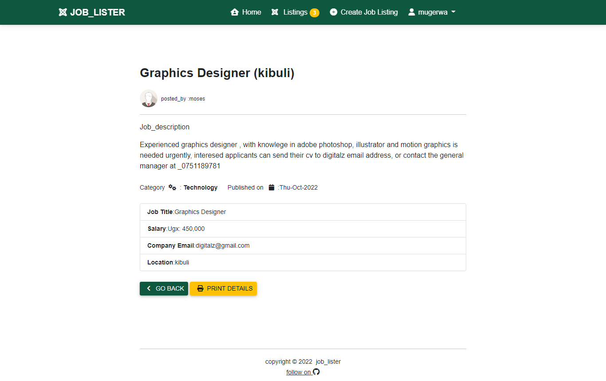
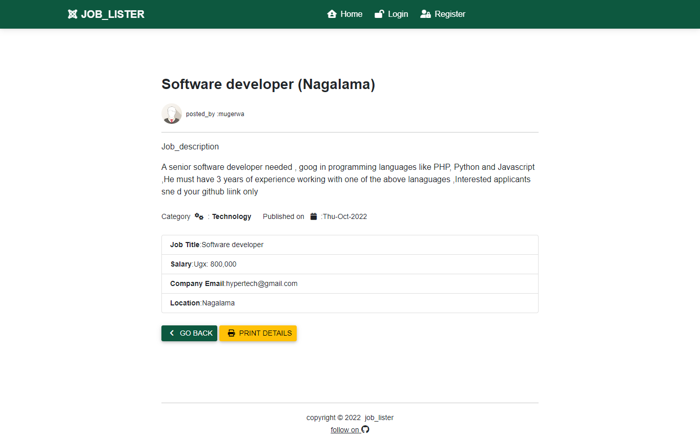
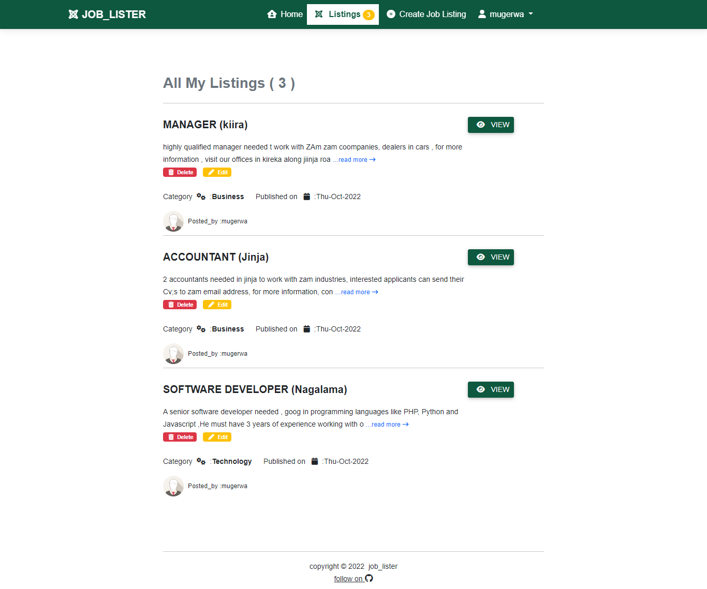
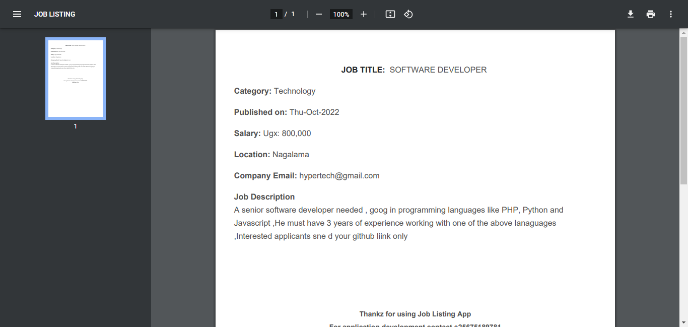
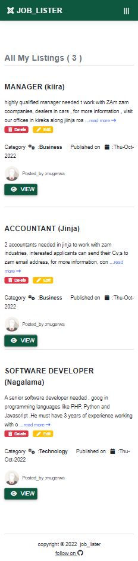
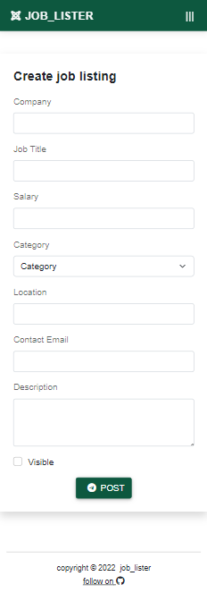

 #still in developemt mode!!
 #job_listing is Uganda’s #1 Professional platform that connects job seekers with employers. 
It helps job seekers to search for jobs & talk to the corresponding HRs of the companies directly and vice versa.
job_listing app is 100% genuine and has 0% tolerance towards fake employers and job seekers who create ruckus and cause problems to others.  
How do I get a job using the app?  
#technologies 
Job_listing was developed using Laravel 9.33.0  
Laravel is a web application framework with expressive, elegant syntax , i love it.........  
For more inf , feel free to contact mi at +25675118981  
Follow these steps to get a job using the app  

1. Log in using your email address  and complete your profile.
2. Select the job categories that match your skills.
3. Find the job of your choice and apply.
4. Downlaod thee report for the selected job and follow instructions 

#screen_shots  

#report

#mobile_View

